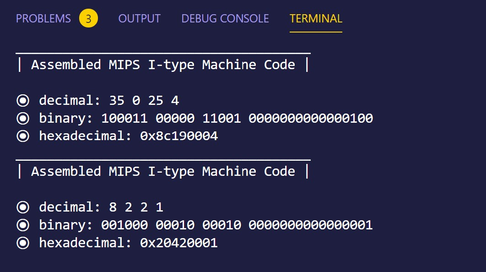

# Reverse Engineering - MIPS

A collection of Python-based assemblers and disassemblers for various CPU architectures, with a current focus on MIPS32/64. This project is designed to help users understand reverse engineering by providing tools to convert assembly code to machine code and vice versa. Future plans include support for ARM-64 and x86 architectures.



> **Note:** This project is primarily educational and may require further modifications for production use.

---

## Table of Contents

- [Overview](#overview)
- [Architecture](#architecture)
- [Directory Structure](#directory-structure)
- [Requirements](#requirements)
- [Usage](#usage)
- [Testing](#testing)
- [Contributing](#contributing)
- [License](#license)
- [Future Work](#future-work)

---

## Overview

This repository provides Python-based tools for assembling and disassembling instructions for MIPS architectures. The current focus is on MIPS32/64, and upcoming updates will add support for ARM-64 and x86 architectures. The codebase includes:

- **assembler.py**: Converts MIPS assembly instructions into machine code.
- **disassembler.py**: Converts machine code back into human-readable assembly instructions.

---

## Architecture

The project is designed with modularity in mind, allowing for easy extension to additional architectures. Each tool is implemented in a clear, straightforward manner to serve as an educational resource for reverse engineering and computer architecture concepts.

---

## Directory Structure

- **assembler.py**: Python script for converting MIPS assembly instructions to machine code.
- **disassembler.py**: Python script for converting MIPS machine code back to assembly instructions.
- **output.jpg**: Sample image showcasing the output of the tools.
- **LICENSE**: MIT License.

---

## Requirements

- **Python 3.9.1 or later (64-bit):**  
  [Download Python](https://www.python.org/)

- **MIPS Assembler and Runtime Simulator (Optional):**  
  [MIPS Simulator](https://courses.missouristate.edu/) *(for testing and verification)*

---

## Usage

1. **Clone the Repository:**

    ```bash
    git clone https://github.com/sabneet95/Reverse-Engineering.git
    ```

2. **Open the Project:**

    Use an IDE such as [Visual Studio Code](https://code.visualstudio.com/) with Python extensions.

3. **Running the Assembler:**

    - Edit `assembler.py` to define your MIPS instructions. For example:
      ```python
      instructions = [
          ['addi', '$v0', '$zero', '0'],
          ['lw', '$t9', '0', '$a0']
      ]
      ```
    - Run the assembler from the terminal:
      ```bash
      python assembler.py
      ```

4. **Running the Disassembler:**

    - Edit `disassembler.py` to define your machine code instructions. For example:
      ```python
      instructions = [
          '00000001101011100101100000100100',
          '10001101010010010000000000001000'
      ]
      ```
    - Run the disassembler from the terminal:
      ```bash
      python disassembler.py
      ```

---

## Testing

*Note: There are currently no automated tests integrated. Contributions to add a testing framework (e.g., using pytest) are welcome.*

---

## Contributing

Contributions are welcome! To contribute:

1. **Discuss Major Changes:**  
   Open an issue to discuss proposed changes before submitting pull requests.

2. **Follow Coding Standards:**  
   Ensure your code is well-documented with clear inline comments and include tests where applicable.

3. **Submit Pull Requests:**  
   Provide clear descriptions of your changes and ensure that any new features or fixes are tested.

---

## License

This repository is licensed under the [MIT License](LICENSE).

---

## Future Work

Planned enhancements for this project include:
- Adding support for ARM-64 and x86 architectures.
- Integrating a testing framework for automated regression tests.
- Expanding documentation with detailed examples, design rationale, and a project roadmap.

---

*For further information or questions, please refer to the repository's issues or contact the maintainers directly.*

