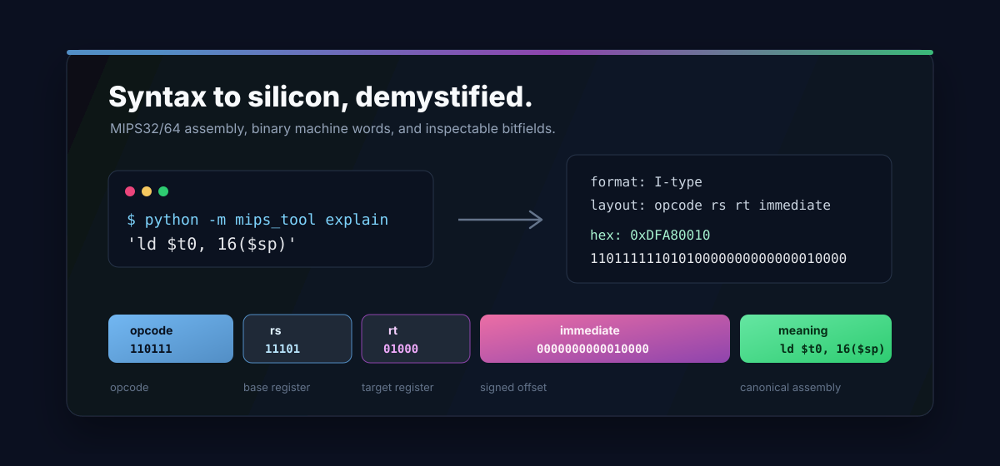
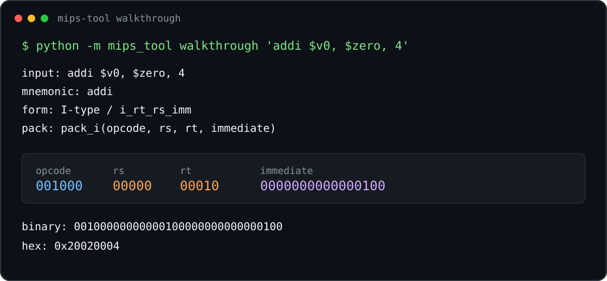

<div align="center"><a name="readme-top"></a>

# 🛠️ Reverse Engineering — MIPS32/64 Instruction Encoder & Decoder

[](https://www.python.org/)
[](#-supported-scope)
[](#-try-it-in-30-seconds)
[](#-testing--verification)
[](LICENSE)

[](https://codespaces.new/sabneet-bains/Reverse-Engineering)

**Syntax to silicon, demystified.**

<sup><i>A focused Python toolkit that assembles, disassembles, and explains MIPS32/64 instruction encodings at the bitfield level.</i></sup>



</div>

<br>

> [!NOTE]
> <sup>Part of the <b>Foundational & Systems</b> collection: compact engineering projects built to make low-level computing inspectable.</sup>

> [!IMPORTANT]
> This is a showcase-quality educational assembler/disassembler, not a complete vendor-manual MIPS implementation. Unsupported instructions fail with clear errors instead of producing misleading output.

<br>

## 🧭 Navigation

| Goal | Start here | What you will see |
|:--|:--|:--|
| **Understand the tool** | [Project Highlights](#-project-highlights) | The value and core capabilities in under a minute |
| **Run it quickly** | [Try It in 30 Seconds](#-try-it-in-30-seconds) | Copy-pasteable CLI commands with real output |
| **Learn the encoding** | [How MIPS Encoding Works](#-how-mips-encoding-works) | R/I/J instruction anatomy explained from first principles |
| **Inspect the design** | [Architecture & Design](#️-architecture--design) | Package structure, data flow, tests, and extension path |

<br>

## 🏆 Project Highlights

This project turns a low-level machine-code concept into a working, testable, explainable tool.

| Signal | Evidence in this repo |
|:--|:--|
| **Systems fundamentals** | Encodes and decodes MIPS instruction formats, registers, immediates, jumps, branches, and memory operands |
| **Bit-level reasoning** | Uses explicit field extraction, packing, masking, sign extension, and canonical formatting |
| **Software design** | Separates parser, tables, encoder, decoder, bitfield explainer, CLI, and tests |
| **User empathy** | Provides novice-friendly explanations plus advanced library/CLI workflows |
| **Engineering rigor** | Includes examples, pytest coverage, CI, and clear unsupported-input errors |

> [!TIP]
> The central design choice: every instruction should be auditable as structured data, not treated as a magic string.

### Project Snapshot

| Metric | Current Value |
|:--|:--|
| **Real supported mnemonics** | 105 |
| **Pseudo-instructions** | 8 |
| **Total supported names** | 113 |
| **CLI modes** | `assemble`, `disassemble`, `explain`, `walkthrough` |
| **Collected tests** | 65 |
| **CI** | GitHub Actions runs lint, typing, compile, tests, package build, and CLI smoke checks |

<div align="right">

[](#readme-top)

</div>

<br>

## ⚡ Try It in 30 Seconds

### 1. Assemble

```bash
python -m mips_tool assemble 'addi $v0, $zero, 4'
```

```text
00100000000000100000000000000100
0x20020004
```

### 2. Disassemble

```bash
python -m mips_tool disassemble 00100000000000100000000000000100
```

```text
addi $v0, $zero, 4
```

### 3. Explain the Bitfields

```bash
python -m mips_tool explain 'ld $t0, 16($sp)'
```

```text
assembly: ld $t0, 16($sp)
format:   I-type
layout:   opcode rs rt immediate
binary:   11011111101010000000000000010000
hex:      0xDFA80010

Field      Bits   Value             Meaning
-----      ----   -----             -------
opcode     31:26  110111            ld
rs         25:21  11101             $sp
rt         20:16  01000             $t0
immediate  15:0   0000000000010000  16
```

> [!TIP]
> In PowerShell, use single quotes around assembly text. Register names such as `$t0` and `$sp` are treated as variables inside double quotes.

### 4. Walk Through the Encoding

```bash
python -m mips_tool walkthrough 'addi $v0, $zero, 4'
```

```text
input:     addi $v0, $zero, 4
kind:      assembly
mnemonic:  addi
operands:  $v0, $zero, 4
form:      I-type / i_rt_rs_imm
table:     opcode=0x08, kind=i_rt_rs_imm
pack:      pack_i(opcode, rs, rt, immediate)
assembly:  addi $v0, $zero, 4
binary:    00100000000000100000000000000100
hex:       0x20020004

bitfields:
Field      Bits   Binary            Meaning
-----      ----   ------            -------
opcode     31:26  001000            addi
rs         25:21  00000             $zero
rt         20:16  00010             $v0
immediate  15:0   0000000000000100  4
```

<br>

<div align="center">



</div>

<br>

<div align="right">

[](#readme-top)

</div>

<br>

## 🧩 How MIPS Encoding Works

### Tiny Field Glossary

| Term | Meaning |
|:--|:--|
| `opcode` | The top six bits that select the broad instruction family |
| `rs` | First source register field |
| `rt` | Second register field; often a source or destination depending on format |
| `rd` | Destination register field for many R-type instructions |
| `shamt` | Shift amount field used by fixed-shift instructions |
| `funct` | Function code that refines `SPECIAL` R-type instructions |
| `immediate` | Inline constant, branch offset, or memory displacement |

### MIPS in 60 Seconds

MIPS is a load/store architecture with 32 general-purpose registers. Most instructions are one 32-bit word. A 5-bit register field can name one of 32 registers, so fields like `rs`, `rt`, and `rd` are enough to describe source and destination registers. Immediate fields store constants or branch offsets, while function fields refine shared opcodes such as `SPECIAL`.

```text
$t0  -> register 8  -> 01000
$sp  -> register 29 -> 11101
16   -> immediate   -> 0000000000010000
```

MIPS instructions are 32-bit records. The instruction’s first six bits are usually the `opcode`; the remaining fields depend on the format.

| Format | Field Layout | Used For | Example |
|:--|:--|:--|:--|
| **R-Type** | `opcode rs rt rd shamt funct` | Register-register operations | `add $t0, $t1, $t2` |
| **I-Type** | `opcode rs rt immediate` | Immediates, branches, load/store | `lw $t1, 8($t2)` |
| **J-Type** | `opcode address` | Long jumps | `j 0x10` |
| **Specialized** | COP0/COP1-specific fields | Representative system/FPU operations | `add.s $f6, $f4, $f8` |

### R-Type Example

```text
add $t0, $t1, $t2

opcode  rs     rt     rd     shamt  funct
000000  01001  01010  01000  00000  100000
```

### I-Type Example

```text
lw $t1, 8($t2)

opcode  rs     rt     immediate
100011  01010  01001  0000000000001000
```

### J-Type Example

```text
j 0x10

opcode  address
000010  00000000000000000000010000
```

> [!NOTE]
> The implementation keeps this grammar visible through a named `InstructionWord` view: `opcode`, `rs`, `rt`, `rd`, `shamt`, `funct`, `immediate`, and `address`.

<div align="right">

[](#readme-top)

</div>

<br>

## ⚙️ Architecture & Design

```text
Reverse-Engineering/
├── mips_tool/
│   ├── tables.py       # Shared instruction metadata
│   ├── word.py         # Named bitfield view over a 32-bit instruction
│   ├── parser.py       # Assembly parsing, immediates, memory operands, labels
│   ├── encoder.py      # High-level assembly flow and label resolution
│   ├── encode_*.py     # R/I/coprocessor operand-form encoders
│   ├── decoder.py      # High-level opcode decode flow
│   ├── decode_*.py     # R/I/coprocessor renderers
│   ├── explain.py      # ASCII bitfield explanations
│   └── cli.py          # python -m mips_tool
├── examples/           # MIPS32, MIPS64, pseudo-instruction, FPU/COP0 examples
├── tests/              # pytest coverage for encoding, decoding, labels, errors
├── docs/               # Tutorial, correctness notes, code tour, instruction inventory
├── tools/              # Documentation generation and benchmark helpers
├── assets/             # README visual assets
├── .github/workflows/  # CI test workflow
├── pyproject.toml      # Package metadata, tool config, and console script
├── CONTRIBUTING.md     # Short rules for adding tested instructions
├── CHANGELOG.md        # Release notes
├── LICENSE
└── README.md
```

### Design Principles

| Principle | How it appears |
|:--|:--|
| **Bitfield-first** | Instructions are treated as structured 32-bit data with named fields |
| **Single source of truth** | Encoder and decoder share instruction metadata from `tables.py` |
| **Progressive disclosure** | CLI output is simple; `explain` reveals the underlying fields |
| **Guided inspection** | `walkthrough` shows parsing, selected form, bitfields, binary, and hex |
| **Clear failure modes** | Unsupported mnemonics and malformed operands raise user-facing errors |
| **Testable examples** | README commands, examples, and tests all use the same real interfaces |

### Why It Works

MIPS encoding is naturally structured: the instruction word is a compact record
with named fields. This project keeps that structure visible instead of hiding it
behind a heavy abstraction. The source mirrors the ISA: high-level flow files
route to R-type, I-type, J-type, FPU, and COP0 forms, while shared tables keep the
assembler and disassembler aligned.

### Design Tradeoffs

| Decision | Why it improves the project |
|:--|:--|
| **Broad documented subset, not full ISA** | Keeps scope honest, inspectable, and testable |
| **ASCII explanations before generated diagrams** | Makes output deterministic, CLI-friendly, and easy to test |
| **Shared instruction tables** | Prevents assembler/disassembler drift |
| **Explicit unsupported-input errors** | Avoids silently producing plausible but wrong machine code |
| **Library plus CLI** | Supports quick terminal use and reusable APIs without splitting the code path |

### Data Flow

```text
assembly text
    ↓
parser.py          normalize mnemonic, operands, immediates, memory syntax
    ↓
tables.py          select opcode, function code, and operand form
    ↓
encoder.py         resolve labels and pseudo-instructions
    ↓
encode_r/i/...     pack fields into a 32-bit instruction word
    ↓
EncodedInstruction expose binary, hex, canonical assembly, and field metadata
    ↓
explain.py / cli.py render user-facing output
```

The reverse path uses `decoder.py`, `decode_r/i/...`, and `word.py` to extract fields from a 32-bit word and reconstruct canonical assembly.

<div align="right">

[](#readme-top)

</div>

<br>

## 📌 Supported Scope

| Area | Current Support |
|:--|:--|
| **MIPS32 Integer** | Arithmetic, logical, shifts, comparisons, jumps, branches, load/store, HI/LO moves, multiply/divide, trap-style encodings, `syscall`, `break` |
| **MIPS64 Integer** | Representative 64-bit arithmetic, 64-bit shifts, doubleword load/store, and sign/zero-extension memory variants |
| **Labels** | Two-pass label resolution for example/program assembly |
| **Pseudo-Instructions** | `li`, `move`, `clear`, `nop`, `not`, `b`, `beqz`, `bnez` |
| **FPU / COP1** | Representative moves and arithmetic: `mfc1`, `mtc1`, `add.s`, `sub.s`, `mul.s`, `div.s`, `add.d`, `sub.d`, `mul.d`, `div.d` |
| **COP0** | Representative system-control moves plus `eret`: `mfc0`, `mtc0`, `eret` |
| **ARM / x86** | Future comparison modules, not current functionality |

Unsupported mnemonics, malformed operands, out-of-range immediates, and unknown encodings raise user-facing errors.

> [!IMPORTANT]
> “MIPS32/64 support” here means broad, tested, documented subset coverage. It does not claim exhaustive coverage of every MIPS revision, vendor extension, relocation mode, or assembler directive.

### Exact Instruction Inventory

The checked-in inventory is generated from `mips_tool.tables`: [docs/instruction-set.md](docs/instruction-set.md).

Regenerate it with:

```bash
python tools/generate_instruction_inventory.py > docs/instruction-set.md
```

<details>
<summary>Show supported mnemonics</summary>

| Group | Mnemonics |
|:--|:--|
| **R-type / SPECIAL** | `add`, `addu`, `sub`, `subu`, `and`, `or`, `xor`, `nor`, `slt`, `sltu`, `dadd`, `daddu`, `dsub`, `dsubu`, `sll`, `srl`, `sra`, `dsll`, `dsrl`, `dsra`, `dsll32`, `dsrl32`, `dsra32`, `sllv`, `srlv`, `srav`, `dsllv`, `dsrlv`, `dsrav`, `jr`, `jalr`, `mfhi`, `mthi`, `mflo`, `mtlo`, `mult`, `multu`, `div`, `divu`, `dmult`, `dmultu`, `ddiv`, `ddivu`, `syscall`, `break`, `tge`, `tgeu`, `tlt`, `tltu`, `teq`, `tne` |
| **I-type / REGIMM** | `addi`, `addiu`, `slti`, `sltiu`, `andi`, `ori`, `xori`, `daddi`, `daddiu`, `lui`, `beq`, `bne`, `blez`, `bgtz`, `bltz`, `bgez`, `bltzal`, `bgezal`, `lb`, `lh`, `lwl`, `lw`, `lbu`, `lhu`, `lwr`, `lwu`, `ldl`, `ldr`, `ld`, `sb`, `sh`, `swl`, `sw`, `swr`, `sdl`, `sdr`, `sd`, `teqi`, `tnei` |
| **J-type** | `j`, `jal` |
| **FPU / COP1** | `add.s`, `sub.s`, `mul.s`, `div.s`, `add.d`, `sub.d`, `mul.d`, `div.d`, `mfc1`, `mtc1` |
| **COP0** | `mfc0`, `mtc0`, `eret` |
| **Pseudo-instructions** | `li`, `move`, `clear`, `nop`, `not`, `b`, `beqz`, `bnez` |

</details>

### Known Limits

This project intentionally does not implement assembler directives, relocation records, macro systems, full ABI handling, delay-slot analysis, exhaustive MIPS revision coverage, or every vendor extension. Some familiar mnemonics are intentionally unsupported until their exact encoding and operand behavior are added to `tables.py` with tests.

Example failure:

```bash
python -m mips_tool assemble 'mul $t0, $t1, $t2'
```

```text
error: unsupported instruction: mul
```

Malformed operand failure:

```bash
python -m mips_tool assemble 'lw $t0, $sp'
```

```text
error: expected memory operand offset(base), got: $sp
```

<div align="right">

[](#readme-top)

</div>

<br>

## 👩‍💻 Library API & Examples

### Library API

```python
from mips_tool import assemble_instruction, assemble_program
from mips_tool import decode_instruction, explain_instruction, walkthrough_instruction

encoded = assemble_instruction("lw $t1, 8($t2)")[0]
assert encoded.hex == "0x8D490008"

decoded = decode_instruction(encoded.binary)
assert decoded.assembly == "lw $t1, 8($t2)"

print(explain_instruction("addi $v0, $zero, 4"))
print(walkthrough_instruction("addi $v0, $zero, 4"))
```

`assemble_instruction()` returns `EncodedInstruction` objects with `.assembly`, `.binary`, `.hex`, `.word`, and `.fields`, so advanced users can build tests, diagrams, or custom renderers without scraping CLI text.

### Example Programs

```bash
python -m mips_tool assemble examples/integer.asm --format hex
python -m mips_tool assemble examples/mips64.asm --format hex
python -m mips_tool assemble examples/fpu_cop0.asm --format hex
python -m mips_tool assemble examples/pseudo.asm --format both
python -m mips_tool assemble examples/tutorial.asm --format both
```

Pseudo-instructions show their real expansion:

```bash
python -m mips_tool assemble examples/pseudo.asm --format both
```

```text
li $t0, 0x12345678 -> lui $at, 4660
00111100000000010001001000110100
0x3C011234
li $t0, 0x12345678 -> ori $t0, $at, 22136
00110100001010000101011001111000
0x34285678
move $t1, $t0 -> addu $t1, $t0, $zero
00000001000000000100100000100001
0x01004821
clear $t2 -> addu $t2, $zero, $zero
00000000000000000101000000100001
0x00005021
b start -> beq $zero, $zero, -5
00010000000000001111111111111011
0x1000FFFB
```

### Extending the Tool

| Goal | Direction |
|:--|:--|
| Add more MIPS instructions | Extend `tables.py` with instruction specs and operand forms |
| Add richer validation | Add parser/operand checks plus negative tests |
| Add visual output | Generate diagrams from the same field metadata used by `explain` |
| Compare architectures | Add ARM/x86 modules using the same explainable bitfield model |
| Teach interactively | Build a notebook or simulator around the library API |

### Design Notes

- [Tutorial](docs/tutorial.md) walks through common instructions from syntax to bitfields.
- [Correctness Notes](docs/correctness.md) describe scope, vector strategy, and unsupported behavior.
- [Code Tour](docs/code-tour.md) explains what each source file owns and why the layout stays simple.
- [Vector Provenance](docs/vector-provenance.md) documents the instruction-vector source scope.
- [Contributing](CONTRIBUTING.md) keeps instruction additions small, tested, and explicit.
- [Changelog](CHANGELOG.md) records the current release shape.

<div align="right">

[](#readme-top)

</div>

<br>

## ✅ Testing & Verification

Install with development dependencies:

```bash
python -m pip install -e ".[dev]"
```

Run the full suite:

```bash
python -m ruff check .
python -m mypy mips_tool tools
python -m compileall mips_tool tests tools
python -m pytest
python -m build
```

CI runs lint, typing, compile, tests, package build, and CLI smoke checks through GitHub Actions on every push and pull request.

Run a lightweight local benchmark:

```bash
python tools/benchmark.py --quick
```

**Covered Scenarios**

- R/I/J instruction encoding and decoding.
- MIPS64 representative instructions.
- Memory operand parsing.
- Label resolution.
- Pseudo-instruction expansion.
- FPU and COP0 representative instructions.
- Bitfield explanation output.
- Fixed instruction vectors across R/I/J, MIPS64, COP0, and COP1 forms.
- Table consistency across every supported real instruction form.
- CLI success and failure exit codes.
- Walkthrough output for real, pseudo, and machine-word inputs.
- Parser integer formats and register aliases.
- Unsupported machine-word decode failures.
- Generated instruction inventory staying synchronized with `tables.py`.
- Public API return shape and pseudo-instruction metadata.
- Benchmark script smoke coverage.
- Clear failures for unsupported or malformed input.

<br>

<div align="center">

## 👤 Author

**Sabneet Bains**

*Quantum × AI × Scientific Computing*

[LinkedIn](https://www.linkedin.com/in/sabneet-bains/) • [GitHub](https://github.com/sabneet-bains)

## 📄 License

Licensed under the [MIT License](LICENSE).

<sub>“Reverse engineering is not about undoing complexity; it is about understanding design.”</sub>

</div>
